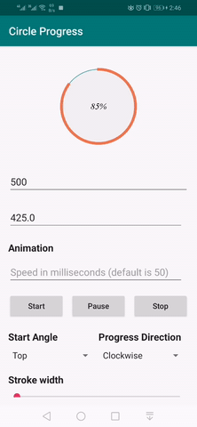
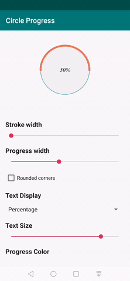
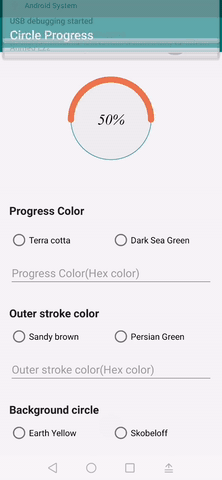

# CircleProgress
CircleProgress is a highly customizable lightweight library to create
circular progress bars for Android





## Setup


To import the Circle Progress library to Android Studio, use the method
below


1. Open your project in Android Studio
2. Download the library (using Git, or a zip archive to unzip)
3. Go to File > Import Module and import the library as a module
4. Right-click your app in project view and select "Open Module Settings"
5. Click the "Dependencies" tab and then the '+' button
6. Select "Module Dependency"
7. Select "circleprogress" (not CircleProgress_Android Project)

## Usage
How to use

Add view to your layout
```xml
<com.linkdev.circleprogress.CircularProgress
        android:id="@+id/progressCircular"
        android:layout_width="wrap_content"
        android:layout_height="wrap_content"
        app:progress="50"
       />
```
Usage for all attributes
```xml
    <com.linkdev.circleprogress.CircularProgress
        android:id="@+id/progressCircular"
        android:layout_width="200dp"
        android:layout_height="200dp"
        android:layout_gravity="center_horizontal"
        app:innerCircleBackground="#ff00ff"
        app:max="100"
        app:outerStrokeColor="#797474"
        app:outerStrokeThickness="1dp"
        app:progress="75"
        app:text="hello world"
        app:progressDirection="Clockwise"
        app:progressRoundedEnd="false"
        app:progressStrokeColor="#ff0000"
        app:progressStrokeThickness="5dp"
        app:showDecimalZero="false"
        app:startAngle="Top"
        app:textColor="#000000"
        app:textDisplay="ProgressPercentage"
        app:textSize="12sp" />
```
#### Set Max
This attribute is used to set the max value for the progress
its default value is 100
```xml
 app:max="100"
```
```xml
 app:max="@integer/max"
```
```kotlin
  progressCircular.setMax(100)
```
#### Set inner circle background
This attribute is used to set the background of the inner circle
its default value is transparent
 ```xml
 app:innerCircleBackground="#ff0000"
```
```kotlin
  progressCircular.setInnerCircleBackground(Color.BLUE)
  progressCircular.setInnerCircleBackground(Color.parseColor("#00ffff"))
  progressCircular.setInnerCircleBackground(ResourcesCompat.getColor(
                        resources,
                        R.color.green,
                        null
                    ))
```
#### Set Outer Stroke Color
 This attribute is used to set the color of un finished part of the progress
 its default value is gray
```xml
 app:outerStrokeColor="#ff0000"
```
```kotlin
  progressCircular.setOuterStrokeColor(Color.BLUE)
```

#### Set Outer Stroke width
 This attribute is used to set the width of un finished part of the progress
 its default value is 4dp
```xml
 app:outerStrokeWidth="5dp"
```
```kotlin
  progressCircular.setOuterStrokeWidth(5)
```
#### Set Progress
 This attribute is used to set the progress value
 its default value is 0
```xml
 app:progress="57"
```
Progress value is set as float
```kotlin
  progressCircular.setProgress(57f)
```
also you can set progress with animation by the following
```kotlin
  progressCircular.startProgressAnimation(start_progress_value,end_progress_value,animation_speed)
```
the default of the start progress value is 0
#### Set Progress Direction
 This attribute is used to set the drawing direction of the circle
 either clockwise or anti clockwise the default is clockwise
```xml
 app:progressDirection="Clockwise"
 ```
 ```kotlin
  progressCircular.setProgressDirection(ProgressDirection.CLOCKWISE)
```
 or
```xml
app:progressDirection="Anticlockwise"
```
 ```kotlin
  progressCircular.setProgressDirection(ProgressDirection.ANTICLOCKWISE)
```
#### Set Rounded Corners
 This attribute is used to set if the progress should be rounded corners or not
 the default is false
```xml
 app:roundedCorners="true"
 ```
 ```kotlin
  progressCircular.setProgressRoundedCorners(false)
```
#### Set Progress Stroke Color
 This attribute is used to set the color of the finished part of the progress
 its default value is black
```xml
 app:progressStrokeColor="#ff0000"
```
```kotlin
  progressCircular.setProgressStrokeColor(Color.BLUE)
```

#### Set Progress Stroke Width
 This attribute is used to set the width of finished part of the progress
 its default value is 4dp
```xml
 app:progressStrokeThickness="5dp"
```
```kotlin
  progressCircular.setProgressStrokeThickness(5)
```
#### Start Angle
This attribute is used to set start point of drawing the progress it can be drawn from top,
right, left and bottom the default value is top
```xml
 app:startAngle="Top"
```
```kotlin
  progressCircular.setStartAngle(StartAngle.TOP)
```
or
```xml
 app:startAngle="Bottom"
```
```kotlin
  progressCircular.setStartAngle(StartAngle.BOTTOM)
```
or
```xml
 app:startAngle="Left"
```
```kotlin
  progressCircular.setStartAngle(StartAngle.LEFT)
```
or
```xml
 app:startAngle="Right"
```
```kotlin
  progressCircular.setStartAngle(StartAngle.RIGHT)
```
#### Text Color
This attribute is used to set text color the default is black
```xml
 app:textColor="#000000"
```
```kotlin
  progressCircular.setTextColor(Color.Red)
```
#### Text Size
This attribute is used to set text size the default is 10sp
```xml
 app:textSize="12sp"
```
```kotlin
  progressCircular.setTextSize(12f)
```
#### Text Font
This attribute is used to set text font
```kotlin
  progressCircular.setTextFont(R.font.custom_font)
```
#### Text
By default the displayed text is the percentage value of the progress
(progress / max ) * 100 ,But we can display the progress value itself or
display no text or display any custom text by the following
```xml
 app:textDisplay="ProgressPercentage"
```
```kotlin
progressCircular.setTextDisplay(TextDisplay.PROGRESS_PERCENTAGE)
```
or
```xml
 app:textDisplay="ProgressValue"
```
```kotlin
progressCircular.setTextDisplay(TextDisplay.PROGRESS_VALUE)
```
or
```xml
 app:textDisplay="NoText"
```
```kotlin
 progressCircular.setTextDisplay(TextDisplay.NO_TEXT)
```
or
```xml
 app:text="hello world"
```
```kotlin
  progressCircular.setText("hello world")
```
#### Attention
If you provided text to the circle progress but after that the
textDisplay is set by any value other than PROVIDED_TEXT/ProvidedText the text will be
ignored. The text display type is set automatically by ProvidedText when text is set.
if the text display type is set to ProvidedText and no value was provided in the text nothing will be shown.

## License
Copyright 2020 Link Development

Licensed under the Apache License, Version 2.0 (the "License");
you may not use this file except in compliance with the License.
You may obtain a copy of the License at

    http://www.apache.org/licenses/LICENSE-2.0

Unless required by applicable law or agreed to in writing, software
distributed under the License is distributed on an "AS IS" BASIS,
WITHOUT WARRANTIES OR CONDITIONS OF ANY KIND, either express or implied.
See the License for the specific language governing permissions and
limitations under the License.
